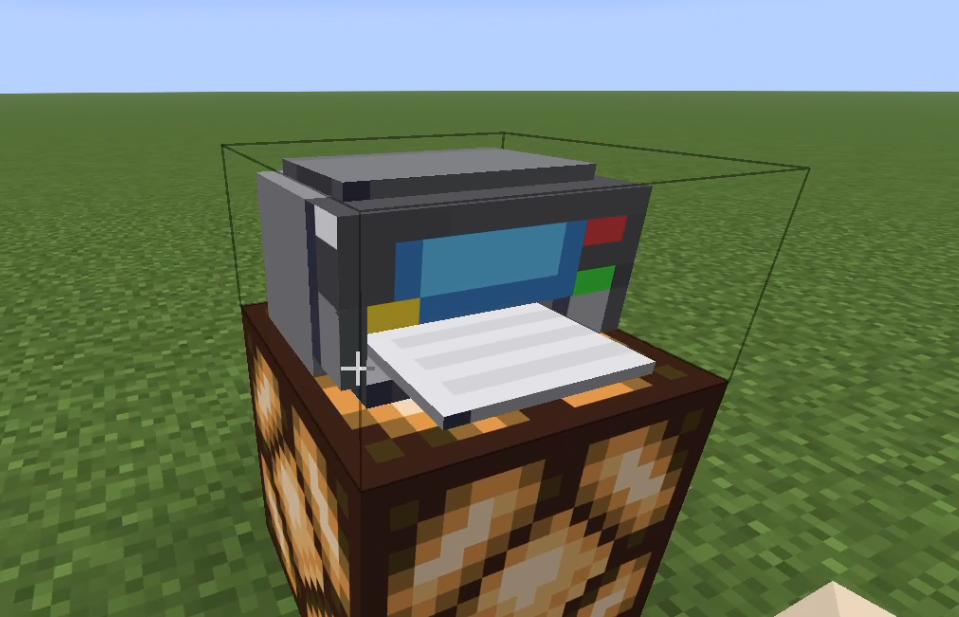
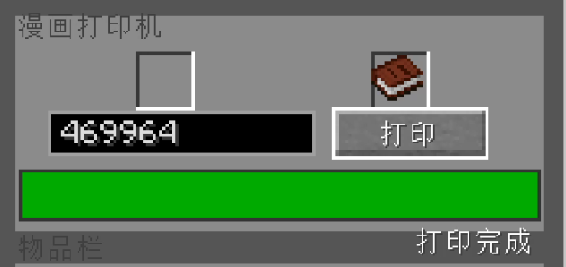
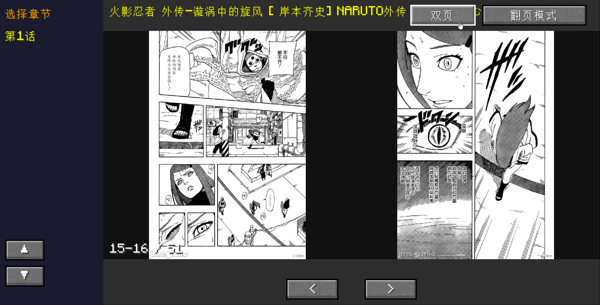

# MCJM - 漫画打印机

> 在 Minecraft 中浏览 JM 漫画 —— 把漫画打印到书里，在游戏内阅读。


<p align="center">
  
</p>

---

## 简介

MCJM 是一个 Minecraft Fabric 模组，让你可以在游戏中下载并阅读 JM 漫画。它包含：

- **打印机方块** — 放入书 + 输入 JM 编号，将漫画打印成漫画书
- **漫画书物品** — 可翻阅/滚动的漫画书，支持单页/双页模式
- **Python 后端服务器** — 负责下载漫画图片并转码

---

## 截图

<p align="center">
  
  <br>
  <em>打印机方块</em>
</p>

<p align="center">
  
  <br>
  <em>打印机界面 - 输入 JM 编号打印漫画</em>
</p>

<p align="center">
  
  <br>
  <em>打印机合成配方</em>
</p>

<p align="center">
  
  <br>
  <em>漫画阅读界面 - 支持翻页/滚动、单页/双页</em>
</p>

---

## 安装

### 依赖

| 组件 | 版本要求 |
|------|---------|
| Minecraft | 1.21.11 |
| Fabric Loader | ≥ 0.16.10 |
| Fabric API | 对应 1.21.11 版本 |
| Python | 3.8+ |

### 步骤

1. **安装 Python** — 运行 `Python安装包（请先安装我）/python-3.14.6-amd64.exe`
2. **安装模组** — 将 `mcjm.jar` 放入 `.minecraft/mods/`
3. **启动后端** — 每次玩之前双击 `server/start_server.cmd`（保持窗口打开）
4. **启动游戏** — 开玩

---

## 使用

### 1. 合成打印机

```
红染料  绿染料  蓝染料
铁块    黑染料  铁块
钻石    红石块  钻石
```

### 2. 准备书

手上拿一本书。

### 3. 打印漫画

- 右键打开打印机 GUI
- 放入书本
- 输入 JM 编号（纯数字）
- 点击 **打印**
- 等待后台下载完成

### 4. 阅读漫画

- 拿到打印好的漫画书
- 右键打开阅读界面
- 支持翻页/滚动模式、单页/双页切换

---

## 项目结构

```
MCJM/
├── mcjm.jar                    # Fabric 模组 (已编译)
├── 使用说明.txt                 # 简易说明
├── assets/                     # 资源文件
│   ├── icon.png                # 项目图标
│   ├── crafting_recipe.png     # 合成配方截图
│   ├── printer_gui.png         # 打印机 GUI 截图
│   ├── printer_model.png       # 打印机模型截图
│   └── comic_reading.png       # 漫画阅读界面截图
├── Python安装包（请先安装我）/
│   ├── python-3.14.6-amd64.exe # Python 安装包
│   └── 图解安装python.png      # 安装教程
└── server/                     # Python 后端服务器
    ├── server.py                # Flask 服务器 (JM下载 + 转码)
    ├── requirements.txt         # Python 依赖
    ├── start_server.cmd         # 启动脚本
    └── Python安装完后先双击我.bat # 首次安装依赖
```

### 模组结构 (mcjm.jar)

```
com.mcjm.mod/
├── MCJM.java                   # 模组主入口
├── MCJMClient.java             # 客户端初始化
├── ModRegistry.java            # 方块/物品/网络注册
├── block/
│   └── PrinterBlock.java       # 打印机方块逻辑
├── block/entity/
│   └── PrinterBlockEntity.java # 打印机方块实体
├── item/
│   └── ComicBookItem.java      # 漫画书物品
├── network/
│   ├── ModNetwork.java         # 网络通信
│   ├── JMApiClient.java        # JM API 客户端
│   └── ImageCache.java         # 图片缓存
├── screen/
│   ├── PrinterScreen.java      # 打印机 GUI
│   ├── PrinterScreenHandler.java
│   └── ComicReadingScreen.java # 漫画阅读界面
```

### 后端 (server.py)

- 基于 **Flask** 的 HTTP API 服务器（端口 `28374`）
- 使用 **jmcomic** 库下载 JM 漫画
- 自动将 WebP 转换为 PNG（有 Pillow 时无损转换）
- 缓存已下载的漫画，避免重复下载

---

## API 接口

后端服务器提供以下 HTTP API：

| 路由 | 方法 | 说明 |
|------|------|------|
| `/api/ping` | GET | 健康检查 |
| `/api/download` | POST | 下载漫画（参数: `album_id`） |
| `/api/progress` | GET | 查询下载进度（参数: `album_id`） |

默认监听 `127.0.0.1:28374`，可通过环境变量 `MCJM_PORT` 修改端口。

---

## 许可证

MIT
